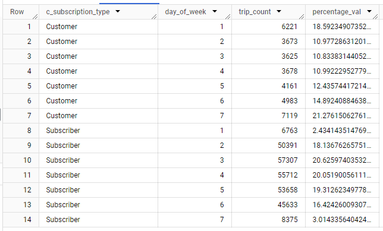
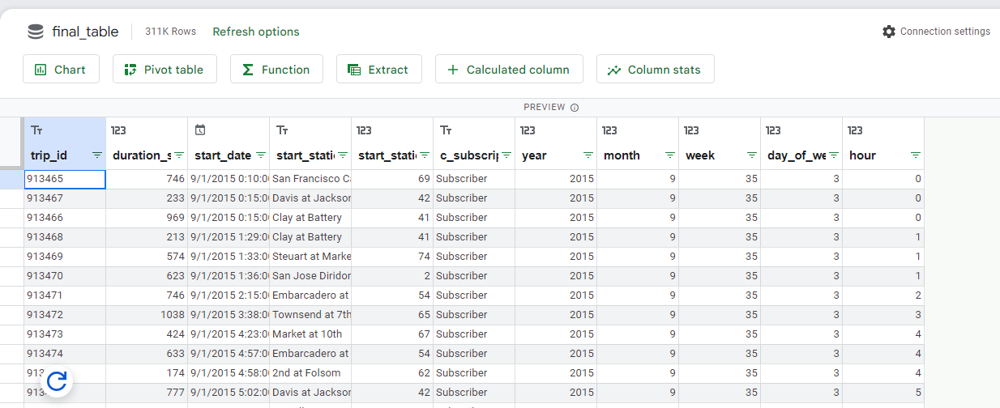
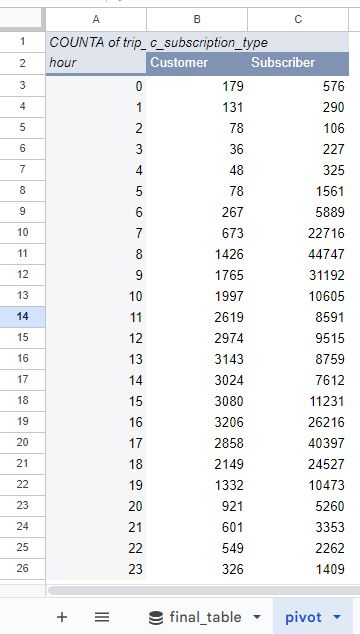
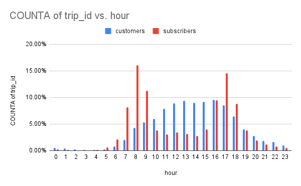
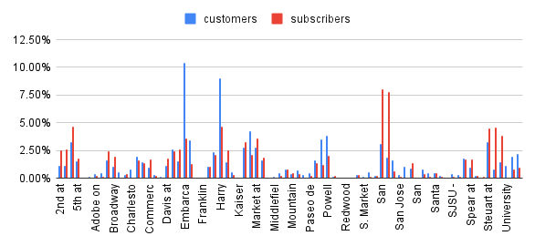
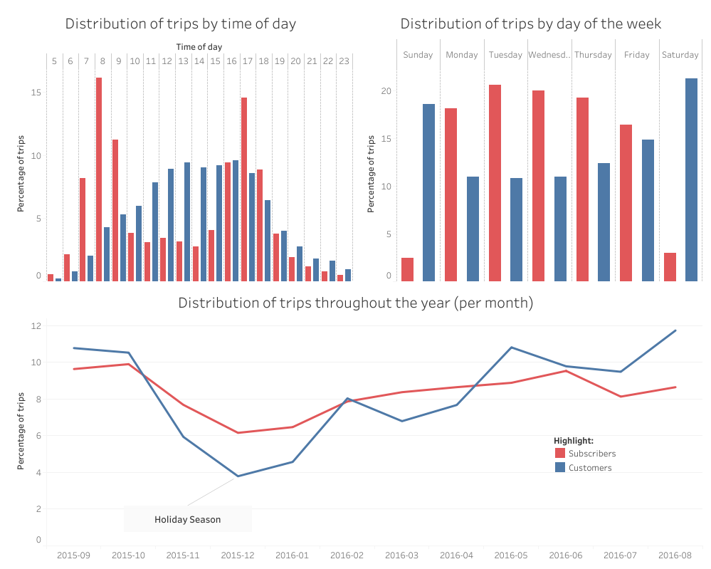

# Bike-sharing Service Usage Analysis

### Case study done as part of the Google Data Analytics Professional Certificate.

#### March 2024.

At the end of the Google Data Analytics Professional Certificate course series, it is suggested that we conduct a case study to put our knowledge into practice. That is precisely the approach taken during this case study: to use it as a practical exercise. This report contains a documentation of the procedures that were followed and a description of the thought process used during the project.

Table of Contents:

- [Scenario](#scenario )
- [The Problem](#the-problem)
- [The Data](#the-data)
- [Cleaning and manipulating](#cleaning-and-manipulating)
- [Analysis](#analysis)
- [Sharing](#sharing)
- [Recommendations](#recommendations)
- [Final Thoughts](#final-thoughts)

[**Go to Summary**](/readme.md)

## Scenario
The data for this study comes from a bike-sharing service in San Francisco, known as Ford GoBike Share. The dataset is available on Google Cloud Public Datasets &mdash; accessible [here](https://console.cloud.google.com/marketplace/product/san-francisco-public-data/sf-bike-share).

In this fictitious scenario, I am collaborating with a marketing team that aims to derive insights from this data for a digital media campaign.

More specifically, the team's goal is to design a new strategy to convert casual riders into subscriber members. They wish to answer three questions:
1. How do casual riders and subscriber members use the service differently?
2. Why would a casual rider become a subscriber?
3. How can digital media have an effect on converting riders?

I am tasked with helping to answer **the first question**, using a full year of data records. Since this is a practice exercise, it is not important exactly which year I take into account. Also, I was specifically asked to deliver the following:

- [ ] A clear statement of the business task.
- [ ] A description of all data sources used.
- [ ] Documentation of any cleaning or manipulation of data.
- [ ] A summary of your analysis.
- [ ] Supporting visualizations and key findings.
- [ ] Your top three recommendations based on your analysis.

I will try to check these off as I go along this analysis. Lastly, for this problem, I know the following:

- A "subscriber" refers to an annual or 30-day member, while a "casual rider" refers to a 24-hour or 3-day member.
- 30% of users commute to work on bikes.

[**Back to Top**](#bike-sharing-service-usage-analysis)

## The Problem

I'll begin by examining the problem from a high-level perspective to determine the questions I need to ask, based on the task I was given. As a reminder, the overarching question I need to answer is: "How do casual riders and subscriber members use the service differently?" I was told that I should present my findings to the company’s marketing director and other executives, who are the main stakeholders. With this primary question in mind, I will keep these stakeholders and their objectives in focus throughout my work and analysis. Furthermore, I must remember their ultimate goal, which is to convert riders into subscribers using a digital marketing campaign.  Since, answering this specific question is in fact my *business task*, I can consider the first deliverable as effectively addressed.

- [x] A clear statement of the business task.

What I plan to do now is to examine the data to understand the kind of information it provides, what type of data exactly is it that was collected. This will help me discern what types of questions the dataset allows me to answer. Specifically, I am interested in identifying metrics and variables within this dataset that can be measured and compared.

Looking at the dataset I can identify four different tables: `bikeshare_regions`, `bikeshare_station_info`, `bikeshare_stations_status` and `bikeshare_trips`. To answer my question I believe the `bikeshare_trips` is the table I should focus on. For now, detailed information about the stations doesn't seem relevant, but I can always come back to these tables if I feel it's necessary. 

Inspecting the main table in this dataset, it looks like each record on that table corresponds to one trip. And for each of these trips, there is information such as: date and time, duration, start and end stations, member type, member birth year, member gender,bike ID and geographical information.

Bike ID is not relevant for my analysis, as the specific bikes being used are not my focus. Profiling users based on gender and age was not something I was asked to look into. Therefore, I will concentrate on comparing how different types of members &mdash; subscribers and casual riders &mdash; are using the bikes. Also, casual riders are called “customers” in the dataset and will be referred to as such from now on.

Now that I have gained an overall perspective of the problem,, I am ready to delve into the specifics of how to approach it. Below are the particular questions I intend to answer, along with how I plan to be able to address them. I have highlighted the information that the dataset won't show me explicitly, which is what I have to extract from it by manipulating the tables:

- Do types of users differ in which days of the week they utilize bikes the most?
	- Count  `trips per day of the week` for both groups.
- How do the groups differ in trip duration?
	- Determine and compare `average trip duration`.
- How do they differ in usage throughout the day?.
	- Analyze `trips per 1-hour intervals`.
- How does the usage change during the year?
	- Analyze `trips per month`, and consider a weekly breakdown for more resolution.
- Are customers starting their trips at specific stations significantly more often? If so, which ones? 
	- Count `trips per start station`and identify any that stand out.
- Heat map of where trips are starting.
    - Count of `trips per start station` and plot using geographical information.

[**Back to Top**](#bike-sharing-service-usage-analysis)

## The Data

As mentioned previously, this dataset is available in the Google Cloud Public Datasets. Utilizing BigQuery, a tool I learned about during this data analytics course, provides an easy way for me to access it. I plan to make a copy of this dataset and store it within my own project in BigQuery for manipulation. Since this is a public dataset, I am allowed to copy and use it for my analysis. Public datasets are made available specifically for educational, research, and analytical purposes, aligning with the nature of my project. At this moment, I will drop the "bikeshare" prefix from the table's names.

I have also already discussed the dataset's structure &mdash; which comprises four different tables, how each record on the table I will focus on &mdash; `trips` &mdash; corresponds to a single trip made by a user, and which variables were collected.

Next, I will assess other characteristics of this dataset: its completeness, consistency, potential biases, and credibility.

This data was collected internally by the company. Assuming the company's data collection processes were correctly designed, implemented, and are functioning as intended &mdash; which I will do for the purposes of this exercise &mdash; I can consider this dataset trustworthy. Moreover, the fact that trips are registered in the database independently of external factors or manual intervention suggests the data collection is unbiased.

However, I recognize one potential bias in the main table that could affect my analysis: it may be biased towards power users. Since there are no user ID tags associated with any of these trips, it's impossible to determine whether a series of trips were made by one person or multiple individuals. Given that much of my analysis will involve counting the number of trips, the behaviors of members who make significantly more trips than others could disproportionately influence the results. Although I see no direct workaround for this issue, I will remain mindful of it during my analysis and ensure to acknowledge this potential bias when sharing my reports.

Additionally, I noticed that the data appears to have been previously cleaned. It is consistent and coherent, meaning that entries across different fields seem to adhere to a specific standard and are appropriate for the fields to which they belong.

Upon inspecting the last year of available data, I discovered some time periods with no observations, indicating the dataset is incomplete. Ideally, I would investigate the reasons for these gaps if I had access to the individuals who gathered and collected this data, but that option is not available to me. Therefore, I will need to select another period that provides a full year of observations for my analysis. This adjustment is manageable, as the primary goal of this study is to practice recently learned data analysis concepts rather than to inform real-world decision-making.

In this dataset, records span from August 2013 to April 2018. After an examination using BigQuery and Google Sheets, I was able to identify a one-year period with uninterrupted observations, which was from September 2015 to August 2016. I have decided to focus my analysis on this timeframe.

To manage the dataset more effectively, I will isolate this specific period from the rest, significantly reducing the amount of data I need to handle. Managing the entire dataset in a spreadsheet is impractical due to its size, and since the data is already in BigQuery, I will perform the separation there. After executing the SQL query below, the dataset was narrowed down from over 2 million rows to just over 300 thousand rows and a new table called `new_trips` was created.

```sql
CREATE TABLE `my_project.case_study.new_trips`
AS (SELECT * -- get all columns    
    FROM `my_project.case_study.trips`
    WHERE start_date BETWEEN "2015-09-01" AND "2016-08-30")  -- only data between these dates
```

And with that, I believe I can mark off the second request I was made.

- [x] A clear statement of the business task.
- [x] A description of all data sources used.
- [ ] Documentation of any cleaning or manipulation of data.
- [ ] A summary of your analysis.
- [ ] Supporting visualizations and key findings.
- [ ] Your top three recommendations based on your analysis. 

[**Back to Top**](#bike-sharing-service-usage-analysis)

## Cleaning and manipulating

At this moment, I am ready to manipulate the data to ensure it can be analyzed effectively. I plan to start with BigQuery, given that the dataset is already hosted there. Depending on how the analysis progresses, I may consider switching to Google Sheets or R if necessary.

As mentioned before, while the data appears clean, I will conduct several checks to confirm this. Running many short SQL queries, with simple functions and statements such as `COUNT()`, `DISTINCT()`, `CAST()`, `INT()`, `STRING()`, `LENGTH()` and `UPDATE`, and applying `ORDER BY` and `WHERE` for ordering and filtering as needed, I verified the following:

- Variable types are accurate, with fields appropriately formatted as integers or strings.
- Each trip is unique, there are no duplicates.
- The registered trip durations range from 1 minute to approximately 25 hours, without any unusual outliers.
- Both duration and station ID fields are correctly formatted as numbers, with no text or unusual entries.
- The `subscription_type` field consistently contains only "subscriber" or "customer," with no unexpected values.
- Date fields are correctly entered.

However, I did encounter one issue: there were 79 distinct `start_station_names`, but only 74 unique `start_station_id`s, and 80 `end_station_names` but again, only 74 unique `end_station_id`s. This indicated a problem with stations sharing *IDs* that should have been unique. Upon further investigation, I found:
- Twelve station *names* were linked to six *IDs*, with each of these *IDs* associated with two different station *names*. The affected IDs were: 21, 26, 30, 33, 83, and 88.
- For *IDs* 83 and 88, each had been assigned a unique station *name*, as expected, but the *names* appeared with different spellings. I resolved this by standardizing the spelling across the dataset.
- For the remaining problematic *IDs*, I tried to cross-reference them in the `stations_info`, but there were no matches. I believe it is likely that they changed stations *names*, *IDs* or even locations since 2016, and the `stations_info` table reflects the *names* and *IDs* being used today. For analysis purposes, I assigned new, unique *IDs* to the ambiguous *names* (IDs assigned: 101, 102, 103, 104), with the understanding that I can’t join the `new_trips` and `stations_info` tables based on the station *IDs*.

Exploring the main table, it's evident that geographical information for the period under review is missing &mdash; all the values for these fields are `NULL`. Additionally, having discovered differences between the station *names* and *IDs* in the `stations_info` table compared to those in the `new_trips` table, I'm unable to use `stations_info` for geographical data. As a result, I have decided to abandon the initial plan of creating a heat map for the most-used stations.

With the data now clean, the next step is to manipulate the data and prepare it for the analysis I intend to conduct. To accomplish this, my approach is to break down the date-time stamps into more granular date or time components, such as the month of each record. During this phase, my objectives are as follows:

- Create new fields for the year, month, week of the year, day of the week, and time of day (in 1-hour intervals).
- Eliminate columns that won’t be necessary for the analysis.

To achieve this, I executed the SQL query below and utilized BigQuery’s user interface to save the results in a new table &mdash; which I called `final_table`. 

```sql
WITH temp_table AS ( 
SELECT -- drop useless columns
  trip_id,
  duration_sec,
  start_date,
  start_station_name,
  start_station_id,
  c_subscription_type
FROM `my_project.case_study.new_trips`)

SELECT 
  *, -- get everything from  temporary table plus the following
  EXTRACT(YEAR FROM start_date) AS year, -- split date into year,
  EXTRACT(MONTH FROM start_date) AS month, -- month,
  EXTRACT(WEEK FROM start_date) AS week, -- week of the year,
  EXTRACT(DAYOFWEEK FROM start_date) AS day_of_week, -- day of the week, sunday = 1
  EXTRACT(HOUR FROM start_date) AS hour -- time of day, 24h format
FROM temp_table
ORDER BY start_date
```

The data is now clean and ready for analysis, enabling me to complete another one of the project's requirements.

- [x] A clear statement of the business task.
- [x] A description of all data sources used.
- [x] Documentation of any cleaning or manipulation of data.
- [ ] A summary of your analysis.
- [ ] Supporting visualizations and key findings.
- [ ] Your top three recommendations based on your analysis. 

[**Back to Top**](#bike-sharing-service-usage-analysis)

## Analysis

Upon inspecting the data, I've realized that for some of the questions I am trying to answer, analyzing the values as percentages of the total makes more sense. For instance, when comparing how customers and subscribers differ in their day of the week preferences for rides, using total counts can be misleading due to potentially large differences in the total number of registered trips for each group. Instead, comparing the percentage of rides made on each day of the week by each group will provide a more accurate representation and avoid skewing the visualization.

I can use BigQuery to obtain counts and percentage values, but visualizing the aggregated data will make it easier to derive insights. Therefore, I will connect a Google Spreadsheet to the BigQuery table using BigQuery’s UI. This setup allows me to create pivot tables for summarization and facilitates insights. As an example, below is an SQL query designed to analyze the distribution of rides by day of the week, revealing the percentage of rides for each group on each day. I also show the resulting table from that query.

Query:

```sql
SELECT
  c_subscription_type,
  day_of_week,
  COUNT(trip_id) AS trip_count, -- count number of trips per aggregated groups 
  CASE c_subscription_type -- get the percentages of rides for each group
    WHEN "Subscriber" THEN COUNT(trip_id) / 277839 * 100 -- 277839 is the total trip count for subscribers
    ELSE COUNT(trip_id) / 33460 * 100 -- 33460 is the total trip count for customers
    -- *100 to show values in percentages
  END AS percentage_val
FROM `my_project.case_study.final_table`
GROUP BY c_subscription_type, day_of_week -- group by 'subscription type + day of the week'
ORDER BY c_subscription_type, day_of_week -- display order
```

Ouput:



 As previously mentioned, the remainder of the analysis was conducted using pivot tables in Google Sheets. This approach allowed me to extract and organize data from the new summarized tables into separate sheets for further analysis. Through this method, I was able to construct charts that facilitated a visual understanding of the differing behaviors between customers and subscribers in their use of the bikes. Below is a preview of the BigQuery-Google Sheets connection and an example of one of the pivot tables that was created.

BigQuery-Google Sheets:



Pivot table:



The resulting graph from the example above clearly illustrates how each member type utilizes the bikes at different times of the day, with subscribers likely commuting to work and customers showing more varied usage patterns throughout the day. The graph derived from this table is shown below. It's important to note that this graph is not the final version intended for sharing but rather a preliminary support visualization that emerged during the exploration of the data.



Given the large number of stations, creating a detailed visualization for trips per station proved challenging, resulting in a chart that was not satisfactory, as seen below. As a result, the chart will not be shared with stakeholders. However, this effort served as a valuable exploratory tool, revealing that certain stations are distinctly favored by each user group.



Let’s take a look at the summary of the results:

- Total trip count: subscribers = 277,389; customers = 33,460.
- Average trip duration (min): subscribers = 9.5; customers = 50.1.
- Activity throughout the week: subscribers bike more during weekdays, while customers are more active during weekends.
- Activity throughout the day: subscribers show two peaks of use at the beginning and end of the day; customer activity is more evenly distributed but generally peaks in the middle of the day.
- Activity throughout the year: Trends are similar for both groups, peaking in summer and dipping in winter. However, subscribers' activity shows less fluctuation.
- Preferred stations: While both groups frequent overall popular stations, the top busiest stations differ for each group.

A couple of other ideas came to mind during the exploration. The first involved examining whether the average trip duration for each group varied by day of the week. The results indicated minimal variation, with the only notable finding being an increase in average duration during weekends for customer-type members. However, this increased activity on weekends by this group was already apparent from the rise in the number of trips they took during these periods.

The second idea was to investigate differences between the groups at individual stations, specifically the busiest ones. This exploration revealed nothing beyond what was already evident in the broader dataset.

While I don't plan on sharing these particular results with stakeholders, I will keep this information on hand in case they ask about it &mdash; support graph accessible [here](images/support_dur_per_day.png). 

This finalizes this part of the project and also means one more item on the deliverables list has been accomplished.

- [x] A clear statement of the business task.
- [x] A description of all data sources used.
- [x] Documentation of any cleaning or manipulation of data.
- [x] A summary of your analysis.
- [ ] Supporting visualizations and key findings.
- [ ] Your top three recommendations based on your analysis. 

[**Back to Top**](#bike-sharing-service-usage-analysis)

## Sharing

The next tool I plan to use is Tableau, where I'll aggregate my findings and create visualizations to support them. Before transferring my data there, I'll ensure that all tables generated from my analysis are clean and organized. While I could use Sheets for visualization, I've chosen Tableau for this case study as a learning exercise, given that it's a new tool for me.

The original goal was to convert casual riders into subscribers. To support this, I was tasked with answering the following question: How do casual riders &mdash; referred to as "customers" &mdash; and subscriber members &mdash; "subscribers" &mdash; use the service differently?

To tackle this problem, I formulated several subsidiary questions:

- Do types of users differ in which days of the week they utilize bikes the most?
- How do the groups differ in trip duration?
- How do they differ in usage throughout the day?.
- How does the usage change during the year?
- Are customers starting their trips at specific stations significantly more often?

Having analyzed the data, I have found answers to these questions, enabling me to describe the distinct usage behaviors of subscribers and customers.

For a better understanding of the findings, please refer to the [image](#dashboard) following this discussion, which offers visual insights that complement the analysis.

My first observation is that usage for both groups fluctuates throughout the year, though it's less pronounced among subscribers. Customers demonstrate greater variability in the frequency of their trips, particularly increasing usage during warmer months. Also, the data shows a significant drop in the number of trips for both groups around the holiday season. While this is a general observation, it logically follows that subscribers, who commit to the service long-term, tend to utilize it more consistently year-round.

Additionally, on average, customers make longer trips than subscribers. Specifically, customers have an average trip duration of 50.1 minutes with a standard deviation of 102.2 minutes, in contrast to subscribers who have an average of 9.5 minutes and a standard deviation of 18.5 minutes. Also, customer activity significantly increases during the weekends, with nearly 40% of all their trips occurring on Saturday or Sunday, compared to about 5% for subscribers.

| Trip duration (min)  |         |                    |
|---------------------:|:-------:|:------------------:| 
|                      | Average | Standard Deviation |
| Customers            |  50.1   |   102.2            |
| Subscribers          |  9.5    |    18.5            | 

Rush hours mark a peak period for subscribers, with almost 70% of their trips starting between 7-9 am and 4-6 pm. In comparison, customer activity is more evenly distributed throughout the day, though there is a notable surge in the early afternoon, and they start 70% of their trips more uniformly between 10 am and 5 pm. 

To summarize, the data reveals the following about subscribers: on average, they undertake shorter trips with a smaller standard deviation and show a pronounced preference for biking during weekdays, especially during rush hours. These trends suggest that subscribers primarily use bikes for commuting to work, aligning with the initial understanding that at least 30% of members utilize the service for this purpose.

In contrast, customer data illustrates: on average, longer trips with a significantly larger standard deviation, a preference for weekend usage, and activity that is more spread out throughout the day. These patterns suggest that customers engage in a broader range of activities, likely including leisure, highlighting their more varied use of the service.

The visualization corresponding to the descriptions above can be seen below. This was created using a Tableau dashboard, primarily for practice rather than necessity. However, this dashboard, accessible [here](https://public.tableau.com/app/profile/lucas.zappe/viz/case_study_01/Dashboard1), allows for some interactive exploration of the data, with the capability to filter charts by subscription type to examine each group's data separately. It's important to note that the horizontal axis on the "trips per time of day" chart begins at 5 am. This design choice was made because the volume of trips between midnight and 5 am is minimal and showing it was compromising the visualization's clarity.

<a id="dashboard"></a>

[](https://public.tableau.com/app/profile/lucas.zappe/viz/case_study_01/Dashboard1)

Even though I was unable to create a heat map of trips and stations due to the lack of geographical information, my analysis revealed that certain stations are more frequently used by each user type. Remarkably, over a third of trips for each group originate from their top 6 busiest stations, with Harry Bridges Plaza (Ferry Building) being the only station shared in the top 6 by both groups. A table showcasing the top 6 stations for each group is shown below.

| Top 6 stations per user type (34% of trips for each group) |                       |
|:-----------------------------------------------------------|:---------------------:|
| ***Subscribers***                                          |**percentage of trips**|
| San Francisco Caltrain (Townsend at 4th)                   | 8.04%                 |
| San Francisco Caltrain 2 (330 Townsend)                    | 7.75%                 |
| Harry Bridges Plaza (Ferry Building)                       | 4.68%                 |
| 2nd at Townsend                                            | 4.64%                 |
| Temporary Transbay Terminal (Howard at Beale)              | 4.58%                 |
| Steuart at Market                                          | 4.49%                 |
| ***Customers***                                            |                       |
| Embarcadero at Sansome                                     | 10.38%                |
| Harry Bridges Plaza (Ferry Building)                       | 8.97%                 |
| Market at 4th                                              | 4.26%                 |
| Powell Street BART                                         | 3.82%                 |
| Powell at Post (Union Square)                              | 3.49%                 |
| Embarcadero at Vallejo                                     | 3.39%                 |

With this analysis and visualization complete, I've successfully addressed a key project deliverable.

- [x] A clear statement of the business task.
- [x] A description of all data sources used.
- [x] Documentation of any cleaning or manipulation of data.
- [x] A summary of your analysis.
- [x] Supporting visualizations and key findings.
- [ ] Your top three recommendations based on your analysis. 

[**Back to Top**](#bike-sharing-service-usage-analysis)

## Recommendations

Before presenting my recommendations, it's important to revisit an earlier point regarding what I believe is a significant limitation of the data: since there are no user ID tags associated with any of these trips, it's impossible to determine whether a series of trips were made by one person or multiple individuals. This distinction is relevant as we aim to convert casual users into subscribers. For instance, identifying the stations frequented by many *people* &mdash; rather than just counting the number of *trips* &mdash; could offer valuable insights. Moreover, the lack of user information prevents us from profiling users and correlating these profiles with their usage patterns.

The marketing team intends to convert users, using a marketing campaign based on digital media. With this in mind, here are my three recommendations for them:

- Target customers being active during rush hours and at the main stations used by subscribers. Emphasize the benefits they could take from commuting to work on a bike. They are either in a busy area or in a time of day that’s really busy. Leveraging these insights ensures that the marketing efforts are directed towards potential subscribers who are most likely to find value in frequent bike usage, similar to existing subscribers.
- Focus some of the campaign on periods when customers are the most active. That way you can reach a bigger audience and it increases the likelihood of engaging casual riders during times when they are more receptive to the idea of riding bikes. These periods are the weekends and during the warmer months of the year.
- Connect this data to the customer information database, if the team can link member IDs to the individual trips, they will be able to better understand user behavior based on their profile and deepen their knowledge on differences between customers and subscribers. 

That completes the study and this exercise. All of the requested items have been accomplished.

- [x] A clear statement of the business task.
- [x] A description of all data sources used.
- [x] Documentation of any cleaning or manipulation of data.
- [x] A summary of your analysis.
- [x] Supporting visualizations and key findings.
- [x] Your top three recommendations based on your analysis.

[**Back to Top**](#bike-sharing-service-usage-analysis)

## Final Thoughts

The study offered strategic insights into differentiating usage patterns between casual riders and subscribers in a bike-sharing service, guiding targeted marketing efforts. By focusing on data-driven recommendations, there’s a clear path forward for converting casual riders into subscribers, leveraging peak activity times and station preferences.

This exercise was incredibly valuable for practicing numerous concepts from the Google Data Analytics Professional Certificate course. It allowed me to sharpen my skills with familiar tools and gain experience with new ones. Additionally, the process of creating this case study revealed other valuable personal lessons:

- Never assume data is clean based solely on a preliminary inspection; always verify and ensure its quality.
- I manipulated a date-time stamp to extract more granular information, such as the specific day of the week, which proved unnecessary. Pivot tables and Tableau &mdash; which were the tools I used &mdash; are capable of performing this task without prior manipulation.
- This project was also a nice opportunity to learn how to write in Markdown.  

I'm excited to keep learning and practicing new skills, and to begin assembling my portfolio.

[**Back to Top**](#bike-sharing-service-usage-analysis)